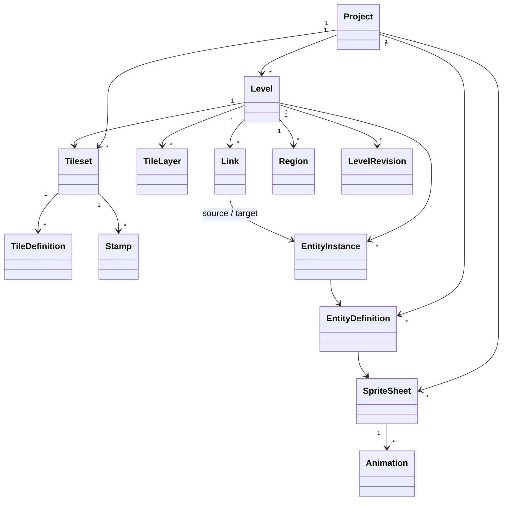
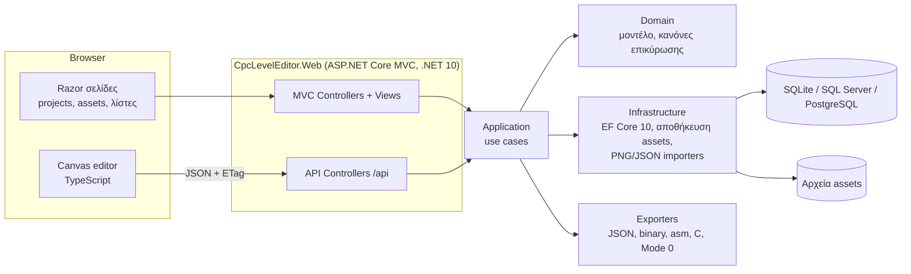

# Editor πιστών CPC Mode 0 — Έγγραφο σχεδιασμού

| | |
|---|---|
| **Έργο** | Action-platformer για Amstrad CPC (Mode 0) με την ηρωίδα και τα 6 επίπεδα του πακέτου `cpc_heroine` |
| **Εφαρμογή** | Web editor πιστών, C# / ASP.NET Core MVC σε .NET 10 (LTS), C# 14 |
| **Έκδοση εγγράφου** | 0.1 — πρόταση προς συζήτηση |
| **Ημερομηνία** | 2026-09-15 |

---

## 1. Σκοπός και πεδίο

Ο editor επιτρέπει στον σχεδιαστή να στήνει τις πίστες του παιχνιδιού πάνω στα γραφικά που έχουν ήδη
παραχθεί στο Aseprite (tiles, εχθροί, αντικείμενα, παγίδες), να τις ελέγχει για λάθη και να τις εξάγει σε
μορφή που διαβάζει η μηχανή του CPC.

**Εντός πεδίου**
- Εισαγωγή του πακέτου γραφικών (`*_sheet.png` + `*_sheet.json` του Aseprite, `manifest.json`, spawn points).
- Ρύθμιση ιδιοτήτων tiles (σύγκρουση, κίνδυνος, νερό, σκάλα…) και ορισμών οντοτήτων (εχθροί, NPC, pickups…).
- Σχεδίαση επιπέδων: ζωγραφική tiles, τοποθέτηση οντοτήτων, συνδέσεις (κλειδί → πόρτα, αγαλματίδιο → παγίδα),
  περιοχές (νερό, κινούμενη άμμος, αεραγωγοί οξυγόνου), σημεία μετάβασης και cutscenes.
- Επικύρωση (προσβασιμότητα, πλήρεις συνδέσεις, όρια μνήμης/sprites).
- Εξαγωγή: JSON, binary για τη μηχανή, include αρχεία assembler/C, προαιρετικά κωδικοποίηση γραφικών Mode 0.
- Προεπισκόπηση κύλισης και animation μέσα στον browser.

**Εκτός πεδίου (για τώρα)**
- Επεξεργασία pixel: το Aseprite παραμένει το εργαλείο των γραφικών.
- Πλήρης εξομοίωση CPC ή εκτέλεση της μηχανής στον browser.
- Σύνθεση μουσικής και ήχων.

---

## 2. Πλαίσιο και περιορισμοί του CPC

### 2.1 Οθόνη και μονάδες

| Στοιχείο | Τιμή |
|---|---|
| Ανάλυση Mode 0 | 160×200 pixels, 16 pens, κάθε pixel 2× πλατύτερο απ' ό,τι ψηλό |
| Byte οθόνης | 1 byte = 2 pixels Mode 0 → οριζόντιες θέσεις sprite καλύτερα σε **ζυγά** pixels |
| Tile | 8×16 pixels Mode 0 (τετράγωνο στην οθόνη), 64 bytes γραφικών |
| Περιοχή παιχνιδιού | 20×11 tiles = 160×176 pixels |
| HUD | οι 24 κάτω γραμμές (176–199) |
| Ρυθμός | 50 Hz (PAL) → οι διάρκειες καρέ του Aseprite (ms) μετατρέπονται σε ticks των 20 ms |

Ο editor εργάζεται **πάντα σε pixels Mode 0** και απλώς σχεδιάζει με αναλογία 2:1 στην οθόνη.

### 2.2 Κοινή παλέτα

| Pen | Hex | Firmware ink | Pen | Hex | Firmware ink |
|---|---|---|---|---|---|
| 0 | 000000 (διάφανο στα sprites) | 0 | 8 | FFFF80 | 25 |
| 1 | 000000 | 0 | 9 | 808000 | 12 |
| 2 | 000080 | 1 | 10 | 808080 | 13 |
| 3 | 008080 | 10 | 11 | FFFFFF | 26 |
| 4 | 80FFFF | 23 | 12 | FF0000 | 6 |
| 5 | 800000 | 3 | 13 | 008000 | 9 |
| 6 | FF8000 | 15 | 14 | 0080FF | 11 |
| 7 | FF8080 | 16 | 15 | FFFF00 | 24 |

### 2.3 Μετρικές της ηρωίδας (για επικύρωση)

| Μετρική | Τιμή |
|---|---|
| Καρέ | 24×64 (όρθια), 64×24 (κολύμπι) |
| Άλμα | ~2 tiles (32 γραμμές) ύψος, ~4 tiles κενό |
| Κυλίσματα | περνάει από άνοιγμα 2 tiles ύψους |
| Πόρτες/περάσματα όρθια | ≥ 4 tiles ύψος |
| Επιπλέον κινήσεις | `climb`, `hang`, `use`, `hurt` (sheet `heroine_actions_cpc_mode0`) |

### 2.4 Τα επίπεδα

| # | Επίπεδο | Κύλιση | Μηχανισμοί που πρέπει να υποστηρίξει ο editor |
|---|---|---|---|
| 1 | Πόλη | οριζόντια, αριστερά→δεξιά | ταράτσες, κλειδί για το υπόγειο γκαράζ, drones, cutscene με muscle car |
| 2 | Δάσος | οριζόντια | κλαδιά-πλατφόρμες, παγίδες με καρφιά, αγαλματίδιο σε βωμό απενεργοποιεί παγίδα |
| 3 | Σπηλιά | κάθετη, κάτω→πάνω | σκαρφάλωμα, 4 βιβλία ανοίγουν την πύλη, σεισμός και πλημμύρα |
| 4 | Υποθαλάσσιο | κάθετη, πάνω→κάτω | οξυγόνο, νάρκες, ηλεκτροφόρα καλώδια, σιφώνι προς την όαση |
| 5 | Έρημος | οριζόντια | κινούμενη άμμος, NPC που πληρώνονται με νομίσματα για κωδικούς, βάση εκτόξευσης |
| 6 | Διαστημικός Σταθμός | οριζόντια | λέιζερ με χρονισμό, πυργίσκοι, κάρτες-κλειδιά, τελικός υπολογιστής, κάψουλα διαφυγής |

---

## 3. Είσοδοι: το πακέτο γραφικών

### 3.1 Δομή φακέλων

```
cpc_heroine/
├── heroine_cpc_mode0*.aseprite / _sheet.png / _sheet.json      ηρωίδα (όρθια, κολύμπι, actions)
├── enemies*_cpc_mode0*, spear_*, bullet_*                      εχθροί γενικής χρήσης, βλήματα
├── projectile_spawn_points.json
├── common/        hud_icons, hud_bars, hud_digits, chars_spawn_points.json
└── level1_city/ … level6_station/
    ├── <sheet>_cpc_mode0.aseprite
    ├── <sheet>_cpc_mode0_sheet.png      indexed PNG (I8), 16 χρώματα
    ├── <sheet>_cpc_mode0_sheet.json     Aseprite JSON (array)
    ├── manifest.json                    περιγραφή sheets του επιπέδου
    └── mockup_*.png, preview_*.png      μόνο για αναφορά
```

### 3.2 JSON του Aseprite

Κάθε `_sheet.json` έχει `frames[]` με `frame {x,y,w,h}` και `duration` (ms), και `meta.frameTags[]` με
`name`, `from`, `to`, `direction`. Τα tile sheets είναι εξαγμένα σε 8 στήλες και τα sprite sheets μία
σειρά ανά tag. **Ο importer διαβάζει πάντα τα ορθογώνια `frame` και δεν υποθέτει διάταξη.**
Αν ένα tag έχει user data (π.χ. `draw_offset_x=4` στο `shoot` της ηρωίδας), αποθηκεύεται ως ιδιότητα του animation.

### 3.3 `manifest.json`

```json
{
  "level": "level1_city",
  "sheets": [
    { "name": "city_drone", "file": "out/frames_city_drone.txt", "kind": "sprites",
      "size": [16, 20], "tags": { "fly": 4, "fire": 2 },
      "anchor": "centred flyer; eye (laser origin) at x=13,y=11 when facing right",
      "description": "…", "tile_names": ["…"] }
  ],
  "mockups": ["out/mockup_city.png"],
  "notes": "…"
}
```

Κανόνες εισαγωγής:
- Το `file` δείχνει στο αρχείο παραγωγής. Ο importer αντιστοιχίζει το `name` με `<name>_cpc_mode0_sheet.json`.
- `kind` = `tiles` → Tileset, `sprites` → SpriteSheet. Το `size` και τα `tags` διασταυρώνονται με το JSON του Aseprite.
- Τα `anchor`, `description`, `notes` είναι ελεύθερο κείμενο: αποθηκεύονται ως σημειώσεις και ο σχεδιαστής
  επιβεβαιώνει άγκυρα και hitbox στην οθόνη του asset.
- Ονόματα tiles: από το `tile_names` όταν υπάρχει (π.χ. Σπηλιά, Έρημος), αλλιώς αυτόματα `<tag>_<n>` με
  δυνατότητα μετονομασίας.
- Sheets που δεν αναφέρονται στο manifest (π.χ. `city_agent` μέσα στο `level1_city`) εισάγονται από σάρωση
  των `*_sheet.json` του φακέλου.

### 3.4 Spawn points βλημάτων

`projectile_spawn_points.json` και `common/chars_spawn_points.json` δίνουν για κάθε sprite το καρέ βολής,
το pixel εκκίνησης και τον τύπο βλήματος:

```json
"city_agent": [ { "tag": "fire", "frame": 6, "tag_frame": 2, "x": 19, "y": 15, "projectile": "bullet" } ]
```

Για sprite που κοιτάζει αριστερά: `x' = frame_width − 1 − x`.

### 3.5 Έλεγχοι κατά την εισαγωγή
- PNG με σωστή υπογραφή, color type 3 (indexed), το πολύ 16 χρησιμοποιούμενα indices, διαστάσεις που
  συμφωνούν με το JSON.
- Κάθε tag συνεχές (`from ≤ to`), όλα τα καρέ ίδιου μεγέθους μέσα στο sheet.
- Επανεισαγωγή: ταυτοποίηση με `name` + SHA-256. Αν αλλάξει ο αριθμός tiles/καρέ, σημειώνονται τα
  επηρεαζόμενα επίπεδα και ζητείται αντιστοίχιση.

---

## 4. Χρήστες και ροές εργασίας

| Ρόλος | Τι κάνει |
|---|---|
| Σχεδιαστής επιπέδων | φτιάχνει/επεξεργάζεται πίστες, τρέχει επικύρωση και προεπισκόπηση |
| Artist | εισάγει/ανανεώνει γραφικά, ορίζει ονόματα tiles, stamps, άγκυρες |
| Προγραμματιστής μηχανής | ορίζει ιδιότητες οντοτήτων, όρια μνήμης, εξάγει δεδομένα |
| Viewer | βλέπει πίστες και αναφορές, χωρίς αλλαγές |

**Κύρια ροή:** εισαγωγή πακέτου → ιδιότητες tiles και stamps → νέο επίπεδο (κύλιση, μέγεθος) → ζωγραφική tiles →
τοποθέτηση οντοτήτων → συνδέσεις και περιοχές → επικύρωση → προεπισκόπηση → εξαγωγή.

---

## 5. Μοντέλο δεδομένων



### 5.1 Tiles

- **TileDefinition**: `Index` (0–254), `Name`, `Tag`, `Flags`, προαιρετικό animation (για animated tiles όπως
  `surface`, `weed`, `vent`) και **κανόνας τοποθέτησης**.
- **Flags** (1 byte, εξάγονται αυτούσια για τη μηχανή):

```csharp
[Flags]
public enum TileFlags : byte
{
    None      = 0,
    Solid     = 1 << 0,   // τοίχος/έδαφος
    Platform  = 1 << 1,   // πατιέται από πάνω, διαπερνάται από κάτω (κλαδιά, ledges)
    Hazard    = 1 << 2,   // τραυματίζει
    Ladder    = 1 << 3,   // σκαρφάλωμα
    Water     = 1 << 4,   // αλλαγή σε κολύμπι
    Quicksand = 1 << 5,   // βύθιση
    Deadly    = 1 << 6,   // άμεσος θάνατος
}
```

- **Κανόνας τοποθέτησης**: αρκετά tiles έχουν ζωγραφισμένο φόντο και ταιριάζουν μόνο σε συγκεκριμένες
  σειρές (Έρημος: σειρές 7–8 για κάκτους, πινακίδες, σκηνές) ή ζώνες νερού (Υποθαλάσσιο: light/mid/deep).
  Αποθηκεύεται ως `AllowedRows` (εύρος) ή `AllowedBand` (όνομα ζώνης που ορίζεται ως περιοχή στο επίπεδο).
  Η παραβίαση δίνει προειδοποίηση, όχι μπλοκάρισμα.
- **Stamp**: ορθογώνια ομάδα tiles με όνομα, π.χ. γκαράζ 4×5 (κλειστό/ανοιχτό), πύλη βιβλίων 4×5,
  είσοδος σπηλιάς, δεξαμενή 2×3, χείλος σιφωνιού, πόρτα καταφυγίου 4×4.

Προτεινόμενα προεπιλεγμένα flags ανά tag (ο artist τα επιβεβαιώνει):

| Tags | Flags |
|---|---|
| `bg*`, `sky`, `window`, `canopy`, `trunk`, `mountain`, `deco*`, `*_open` | None |
| `ground`, `wall*`, `rock`, `sand`, `ceiling`, `cable_anchor`, `siphon_rim` | Solid |
| `platform`, `ledge*`, `pillar_top` | Platform |
| `hazard` | Hazard |
| `ladder` | Ladder |
| `surface`, `flood*`, `pool`, `oasis` (νερό) | Water |
| κινούμενη άμμος | Quicksand |
| `*_closed`, `gate` | Solid, ελέγχεται από οντότητα Door |

### 5.2 Επίπεδα και layers

```csharp
public enum ScrollDirection : byte { LeftToRight, BottomToTop, TopToBottom }
public enum LayerKind : byte { Background, Main, Overlay }

public sealed class Level
{
    public int Id { get; set; }
    public int ProjectId { get; set; }
    public required string Name { get; set; }
    public byte Order { get; set; }
    public ScrollDirection Scroll { get; set; }
    public bool Underwater { get; set; }          // η ηρωίδα ξεκινά με το sheet κολύμβησης
    public int WidthTiles { get; set; }           // οριζόντια: 20 × οθόνες
    public int HeightTiles { get; set; }          // κάθετη: 11 × οθόνες
    public int TilesetId { get; set; }
    public List<TileLayer> Layers { get; } = [];
    public List<EntityInstance> Entities { get; } = [];
    public List<Link> Links { get; } = [];
    public List<Region> Regions { get; } = [];
    public int Version { get; set; }              // concurrency token → ETag
}

public sealed class TileLayer
{
    public int Id { get; set; }
    public LayerKind Kind { get; set; }
    public byte[] Cells { get; set; } = [];       // Width × Height, row-major, 0xFF = κενό
}
```

- **Background**: μόνο εικόνα. **Main**: tiles με flags σύγκρουσης. **Overlay**: διάφανα tiles πάνω από τα
  άλλα (π.χ. `station_laser`, όπου pen 0 = διάφανο).
- Στην εξαγωγή τα Background και Main συγχωνεύονται σε **έναν** χάρτη (το Main υπερισχύει). Τα overlay με
  συμπεριφορά (λέιζερ, καλώδια) εξάγονται ως οντότητες Hazard, ώστε η μηχανή του CPC να μη ζωγραφίζει
  πολλαπλά layers.
- Προκαθορισμένα μεγέθη: οριζόντια 20×N οθόνες × 11, κάθετη 20 × 11×N, ή ελεύθερο μέγεθος.

### 5.3 Οντότητες

```csharp
public enum EntityKind : byte
{
    PlayerStart, Checkpoint, Enemy, Npc, Pickup, Hazard,
    Door, Receptacle, Objective, Transition, Cutscene
}

public sealed class EntityInstance
{
    public int Id { get; set; }
    public required string DefinitionKey { get; set; }   // π.χ. "city_agent"
    public int X { get; set; }                           // pixels Mode 0 (ζυγά = byte-aligned)
    public int Y { get; set; }                           // pixels, βάση άγκυρας
    public bool FacingLeft { get; set; }
    public string PropertiesJson { get; set; } = "{}";   // ιδιότητες κατά το σχήμα του ορισμού
}
```

Κάθε **EntityDefinition** ορίζει: `Key`, `Kind`, sprite sheet και προεπιλεγμένο animation, άγκυρα
(bottom-centre, centre, top-centre, top-left), hitbox, spawn point βλήματος και **σχήμα ιδιοτήτων**
(όνομα, τύπος, όρια, προεπιλογή). Με βάση το σχήμα, ο inspector φτιάχνει αυτόματα τη φόρμα.
Οι ορισμοί που προκύπτουν από το υπάρχον πακέτο βρίσκονται στο [Παράρτημα Α](#παράρτημα-α-οντότητες-ανά-επίπεδο).

### 5.4 Συνδέσεις (Links)

| Είδος | Πηγή → Στόχος | Παράδειγμα |
|---|---|---|
| `Unlocks` | Pickup → Door | κλειδί → γκαράζ, κάρτα-κλειδί → πόρτα σταθμού |
| `Disables` | Receptacle → Hazard | βωμός με αγαλματίδιο → παγίδα με καρφιά |
| `RequiresAll` | Receptacle ×N → Door | 4 υποδοχές βιβλίων → πύλη σπηλιάς |
| `Reveals` | Npc → Door | νομάς (πληρωμή σε νομίσματα) → κωδικός πόρτας καταφυγίου |
| `Activates` | Objective → Pickup / Cutscene | υπολογιστής → χάρτης του πατέρα → κάψουλα |
| `SyncGroup` | Hazard ↔ Hazard | λέιζερ/καλώδια με κοινό χρονισμό και φάση |

### 5.5 Περιοχές (Regions)

Ορθογώνια σε tiles με είδος και παραμέτρους: `Water`, `Quicksand` (ταχύτητα βύθισης), `OxygenVent`
(ρυθμός αναπλήρωσης), `Band` (ζώνη βάθους για κανόνες τοποθέτησης), `CameraLock`, `Trigger`
(π.χ. έναρξη σεισμού, έλξη σιφωνιού).

---

## 6. Αρχιτεκτονική

### 6.1 Επισκόπηση



### 6.2 Solution

```
CpcLevelEditor.sln
├── src/
│   ├── CpcLevelEditor.Web             MVC, Razor Views, API controllers, wwwroot, TypeScript του editor
│   ├── CpcLevelEditor.Application     use cases (ImportAssetPack, SaveLevelOps, ValidateLevel, ExportLevel), DTOs
│   ├── CpcLevelEditor.Domain          οντότητες, value objects, κανόνες επικύρωσης (χωρίς εξαρτήσεις)
│   ├── CpcLevelEditor.Infrastructure  EF Core DbContext/migrations, αποθήκευση αρχείων, PNG/JSON readers
│   └── CpcLevelEditor.Exporters       JSON, binary, asm, C header, κωδικοποίηση Mode 0
└── tests/
    ├── CpcLevelEditor.Tests           xUnit: importers, κανόνες, exporters (golden files)
    ├── CpcLevelEditor.IntegrationTests WebApplicationFactory: API, ETag, auth, antiforgery
    └── CpcLevelEditor.E2E             Playwright for .NET
```

Όλα τα projects: `<TargetFramework>net10.0</TargetFramework>`, `<Nullable>enable</Nullable>`,
`<TreatWarningsAsErrors>true</TreatWarningsAsErrors>`.

### 6.3 Αποφάσεις

| Απόφαση | Επιλογή | Εναλλακτική και λόγος |
|---|---|---|
| UI | MVC/Razor για τις σελίδες διαχείρισης, TypeScript + Canvas 2D για τον editor | Blazor WASM: λιγότερη JS, αλλά ζητήθηκε MVC και ο καμβάς θέλει ούτως ή άλλως άμεση πρόσβαση στο Canvas API |
| Αποθήκευση αλλαγών | batch λειτουργιών (ops) με `PATCH` και ETag | `PUT` όλου του επιπέδου: απλούστερο, αλλά βαρύ και χάνει αλλαγές σε συγκρούσεις |
| Επικύρωση | στον server (C#, Domain), ασύγχρονα μετά από αλλαγές | διπλή υλοποίηση σε TS: ταχύτερη, αλλά δύο εκδοχές των κανόνων |
| Βάση | SQLite προεπιλογή, SQL Server/PostgreSQL για ομάδα | μόνο αρχεία JSON: εύκολο git diff, αλλά χωρίς ταυτοχρονισμό και queries |
| PNG | μικρός δικός μας decoder για indexed PNG (`ZLibStream`) | ImageSharp: πλήρες, αλλά βαρύτερη εξάρτηση και έλεγχος άδειας χρήσης |

### 6.4 Εκκίνηση (`Program.cs`)

```csharp
var builder = WebApplication.CreateBuilder(args);

builder.Services.AddControllersWithViews(o =>
    o.Filters.Add(new AutoValidateAntiforgeryTokenAttribute()));
builder.Services.AddAntiforgery(o => o.HeaderName = "X-CSRF-TOKEN");

builder.Services.AddDbContext<EditorDbContext>(o =>
    o.UseSqlite(builder.Configuration.GetConnectionString("Editor")));

builder.Services.AddDefaultIdentity<IdentityUser>()
    .AddRoles<IdentityRole>()
    .AddEntityFrameworkStores<EditorDbContext>();
builder.Services.AddAuthorization(o =>
{
    o.AddPolicy("CanEdit", p => p.RequireRole("Designer", "Admin"));
    o.AddPolicy("CanImport", p => p.RequireRole("Artist", "Admin"));
});

builder.Services.AddProblemDetails();
builder.Services.AddOpenApi();
builder.Services.AddRateLimiter(o => o.AddFixedWindowLimiter("heavy", l =>
{
    l.PermitLimit = 10;
    l.Window = TimeSpan.FromMinutes(1);
}));

builder.Services.AddScoped<IAssetPackImporter, AssetPackImporter>();
builder.Services.AddScoped<ILevelValidator, LevelValidator>();
builder.Services.AddScoped<ILevelExporter, BinaryLevelExporter>();

var app = builder.Build();

if (app.Environment.IsDevelopment())
    app.MapOpenApi();
else
{
    app.UseExceptionHandler("/Home/Error");
    app.UseHsts();
}

app.UseHttpsRedirection();
app.UseRouting();
app.UseAuthentication();
app.UseAuthorization();
app.UseRateLimiter();

app.MapStaticAssets();
app.MapControllerRoute("default", "{controller=Projects}/{action=Index}/{id?}")
   .WithStaticAssets();
app.MapRazorPages();   // Identity UI

app.Run();
```

---

## 7. Περιβάλλον χρήστη

### 7.1 Σελίδες (MVC)

| Route | Controller.Action | Περιεχόμενο |
|---|---|---|
| `/Projects` | `Projects.Index` | λίστα έργων |
| `/Projects/{id}` | `Projects.Details` | επίπεδα, assets, σύνοψη επικύρωσης, τελευταίες εξαγωγές |
| `/Projects/{id}/Import` | `Assets.Import` | ανέβασμα φακέλου/zip, αναφορά εισαγωγής |
| `/Tilesets/{id}` | `Tilesets.Edit` | ονόματα, flags, κανόνες τοποθέτησης, stamps |
| `/Entities/{projectId}` | `Entities.Index` | ορισμοί οντοτήτων, άγκυρες, hitbox, σχήμα ιδιοτήτων |
| `/Levels/{id}/Edit` | `Levels.Edit` | ο editor (καμβάς) |
| `/Levels/{id}/Preview` | `Levels.Preview` | προεπισκόπηση κύλισης |
| `/Levels/{id}/Export` | `Levels.Export` | επιλογή μορφών, λήψη |

### 7.2 Διάταξη του editor

```
┌─────────────────────────────────────────────────────────────────────────────┐
│ 1 Πόλη ▾ │ B R F E I S T N L G │ Zoom 3× │ Πλέγμα │ Οθόνες │ ▶ Preview │ ⤓ │
├───────────────┬───────────────────────────────────────────┬─────────────────┤
│ Tiles         │                                           │ Layers          │
│  [bg_sky   ▾] │                                           │  ☑ Background   │
│  ▦ ▦ ▦ ▦      │     Καμβάς: pixels 2:1, πλέγμα 8×16,      │  ☑ Main         │
│ Stamps        │     όρια οθόνης 20×11, δείκτης κύλισης    │  ☑ Overlay      │
│  γκαράζ 4×5   │                                           │  ☑ Entities     │
│ Οντότητες     │                                           │  ☑ Regions      │
│  city_agent   │                                           │ Inspector       │
│  city_drone   │                                           │  ιδιότητες      │
│  key · ammo   │                                           │ Συνδέσεις       │
├───────────────┴───────────────────────────────────────────┴─────────────────┤
│ Επικύρωση: 1 σφάλμα, 3 προειδοποιήσεις │ Minimap │ px 212,112 · tile 26,7 · οθόνη 2 │
└─────────────────────────────────────────────────────────────────────────────┘
```

### 7.3 Απόδοση καμβά

- Canvas 2D με `imageSmoothingEnabled = false`. Μετατροπή: `screenX = x × 2 × zoom`, `screenY = y × zoom`,
  zoom μόνο ακέραιος (1–8).
- Σειρά σχεδίασης: Background → Main → Overlay → οντότητες → περιοχές → συνδέσεις (βέλη) → πλέγμα →
  όρια οθονών και προαιρετική λωρίδα HUD.
- Κάθε οθόνη 20×11 αποδίδεται σε `OffscreenCanvas` και ξαναζωγραφίζεται μόνο όταν αλλάξει.
- Animated tiles και sprites με τις διάρκειες του JSON (διακόπτης «Animate»).
- Οι εχθροί που κοιτάζουν αριστερά σχεδιάζονται καθρεφτισμένοι, με το spawn point βλήματος να φαίνεται ως κουκκίδα.

### 7.4 Εργαλεία

| Πλήκτρο | Εργαλείο | Σημειώσεις |
|---|---|---|
| B | Πινέλο | tile ή stamp από την παλέτα |
| R | Ορθογώνιο | γέμισμα περιοχής |
| F | Γέμισμα | flood fill στο ενεργό layer |
| E | Γόμα | 0xFF στο ενεργό layer |
| I | Σταγονόμετρο | επιλέγει tile/stamp |
| S | Επιλογή | μετακίνηση, αντιγραφή/επικόλληση περιοχών μαζί με οντότητες |
| T | Stamp | πολυ-tile ομάδες. Οι πόρτες έχουν stamp κλειστό και ανοιχτό |
| N | Οντότητα | κούμπωμα σε ζυγά pixels ή tiles· `Drop to ground` για όσους περπατάνε |
| L | Σύνδεση | σύρσιμο από πηγή σε στόχο, επιλογή είδους |
| G | Περιοχή | ορθογώνιο σε tiles |
| H / Space / τροχός | Πλέγμα / μετακίνηση / zoom | |
| Ctrl+Z / Ctrl+Y | Undo / Redo | αντίστροφες ops στον client |

### 7.5 Προεπισκόπηση

- **Φάση 2**: κάμερα που κυλά στην κατεύθυνση του επιπέδου με ρυθμό 50 Hz, animations, κύκλοι παγίδων και λέιζερ.
- **Φάση 4**: απλοποιημένη φυσική της ηρωίδας (τόξα άλματος, σκάλες, κολύμπι) για οπτικό έλεγχο προσβασιμότητας.

---

## 8. Επικύρωση

Οι κανόνες ζουν στο Domain και εκτελούνται στον server: αυτόματα 1 s μετά την τελευταία αλλαγή, πάντα πριν
από εξαγωγή. Τα αποτελέσματα εμφανίζονται στη λίστα και ως σημάδια πάνω στον καμβά.

**Προσβασιμότητα:** γράφος από κελιά όπου η ηρωίδα μπορεί να σταθεί. Ένα κελί είναι έγκυρο όταν έχει Solid/Platform από κάτω και 4 tiles ελεύθερα
από πάνω (ή 2 tiles για κύλισμα). Ακμές: περπάτημα, πτώση, άλμα έως 2 tiles πάνω και 4 tiles απόσταση,
σκάλες (Ladder), ελεύθερη κίνηση μέσα σε Water. BFS από το PlayerStart.

| Κωδικός | Σοβαρότητα | Κανόνας |
|---|---|---|
| V001 | Σφάλμα | ακριβώς ένα `PlayerStart` και τουλάχιστον ένα `Transition` τέλους |
| V002 | Σφάλμα | κάθε σύνδεση έχει έγκυρη πηγή και στόχο συμβατού είδους |
| V003 | Σφάλμα | κάθε κλειδωμένη `Door` έχει κλειδί/κάρτα προσβάσιμο **πριν** από αυτήν στη σειρά κύλισης |
| V004 | Σφάλμα | η πύλη της Σπηλιάς έχει 4 υποδοχές και 4 βιβλία, ένα για κάθε σύμβολο |
| V005 | Σφάλμα | κάθε βωμός που απενεργοποιεί παγίδα έχει διαθέσιμο αγαλματίδιο πριν από την παγίδα |
| V006 | Προειδοποίηση | pickup, υποδοχή ή έξοδος που δεν είναι προσβάσιμα |
| V007 | Σφάλμα | πέρασμα στην κύρια διαδρομή χαμηλότερο από 2 tiles |
| V008 | Προειδοποίηση | tile εκτός επιτρεπτής σειράς/ζώνης |
| V009 | Προειδοποίηση | περισσότεροι από N εχθροί/κινούμενα hazards σε μία οθόνη 20×11 (ρυθμιζόμενο) |
| V010 | Προειδοποίηση | Υποθαλάσσιο: απόσταση μεταξύ πηγών οξυγόνου μεγαλύτερη από χρόνο οξυγόνου × ταχύτητα κολύμβησης |
| V011 | Προειδοποίηση | κινούμενη άμμος πλατύτερη από 4 tiles χωρίς πλατφόρμα διαφυγής |
| V012 | Σφάλμα | οντότητα εκτός ορίων ή βυθισμένη σε Solid tile |
| V013 | Προειδοποίηση | τα νομίσματα πριν από έναν NPC δεν φτάνουν για την τιμή του |
| V014 | Πληροφορία | εκτίμηση μνήμης επιπέδου σε σχέση με το όριο του έργου |
| V015 | Σφάλμα | tileset με πάνω από 255 tiles ή tile index που χάθηκε μετά από επανεισαγωγή |

---

## 9. Εξαγωγή

### 9.1 Μορφές

| Μορφή | Αρχεία | Χρήση |
|---|---|---|
| JSON | `level_<n>.json` | εργαλεία, debug, round-trip |
| Binary | `level_<n>.lvl`, `tileflags_<level>.bin` | φόρτωση από τη μηχανή |
| Assembler | `level_<n>.asm` (`db`/`dw`), `entities.inc` | Z80 assemblers |
| C | `level_<n>.h`, `entities.h` | SDCC / CPCtelera |
| Γραφικά Mode 0 | `tiles_<level>.bin`, `sprites_<sheet>.bin` + μάσκες | προαιρετικό module |

Όλες οι μορφές βγαίνουν από το ίδιο byte stream και είναι ντετερμινιστικές: ίδια είσοδος δίνει ίδια bytes.

### 9.2 Binary επιπέδου (little-endian)

| Offset | Μέγεθος | Πεδίο |
|---|---|---|
| 0 | 2 | magic `"LV"` |
| 2 | 1 | έκδοση μορφής |
| 3 | 1 | id επιπέδου |
| 4 | 1 | flags: bits 0–1 κατεύθυνση κύλισης, bit 2 underwater, bit 3 χάρτης RLE |
| 5 | 2 | πλάτος σε tiles |
| 7 | 2 | ύψος σε tiles |
| 9 | 1 | id tileset |
| 10 | 1 | αριθμός οντοτήτων |
| 11 | 1 | αριθμός συνδέσεων |
| 12 | 1 | αριθμός περιοχών |
| 13 | 8 | offsets (u16): χάρτης, οντότητες, συνδέσεις, περιοχές |

- **Χάρτης**: 1 byte/tile, row-major (π.χ. 240×11 = 2.640 bytes πριν από συμπίεση).
- **Οντότητα** (8 bytes): τύπος u8, x u16 (pixels), y u16 (pixels), flags u8 (bit 0 αριστερά, bit 1 ενεργή από την αρχή), param0 u8, param1 u8.
- **Σύνδεση** (4 bytes): είδος u8, πηγή u8, στόχος u8, param u8.
- **Περιοχή** (7 bytes): είδος u8, x u16, y u16 (tiles), w u8, h u8.
- **Διάρκειες animation**: `round(ms / 20)` ticks, ελάχιστο 1.

### 9.3 Κωδικοποίηση γραφικών Mode 0

Κάθε byte περιέχει 2 pixels με πλεγμένα bits (αριστερό pixel στα bits 7,5,3,1, δεξί στα 6,4,2,0):

```csharp
public static byte EncodeMode0(byte left, byte right) =>
    (byte)(((left  & 1) << 7) | ((right & 1) << 6) |    // bit 0 → 7 / 6
           ((left  & 4) << 3) | ((right & 4) << 2) |    // bit 2 → 5 / 4
           ((left  & 2) << 2) | ((right & 2) << 1) |    // bit 1 → 3 / 2
           ((left  & 8) >> 2) | ((right & 8) >> 3));    // bit 3 → 1 / 0
```

- Tile 8×16 → 64 bytes. Για sprites παράγεται και μάσκα διαφάνειας (pen 0): `0xAA` για αριστερό διάφανο
  pixel, `0x55` για δεξί.
- Ο κωδικοποιητής επιβεβαιώνεται με golden test και με μια εικόνα ελέγχου σε emulator πριν μπει στη ροή.
- Η παλέτα εξάγεται ως λίστα firmware inks (§2.2).

### 9.4 Εκτίμηση μνήμης (αναφορά V014)

| Στοιχείο | Υπολογισμός |
|---|---|
| Tiles επιπέδου | tiles × 64 bytes (π.χ. Σπηλιά: 47 × 64 = 3.008 bytes) |
| Χάρτης | πλάτος × ύψος bytes (πριν από RLE) |
| Καρέ sprite | (w/2) × h bytes, ×2 με μάσκα (24×64 → 768 / 1.536 bytes) |
| Ηρωίδα | 50 όρθια καρέ + 12 κολύμβησης ≈ 47,6 KB χωρίς μάσκες |

Η αναφορά κάνει ορατό από νωρίς ότι τα γραφικά πρέπει να φορτώνονται ανά επίπεδο ή/και να συμπιέζονται (βλ. §15).

---

## 10. API (JSON)

| Μέθοδος | Route | Περιγραφή |
|---|---|---|
| GET | `/api/projects/{projectId}/assets` | tilesets, sprite sheets, ορισμοί οντοτήτων (ETag) |
| POST | `/api/projects/{projectId}/imports` | multipart (zip ή αρχεία) → αναφορά εισαγωγής, `201 Created` |
| GET | `/api/sheets/{sheetId}/image` | PNG, `Cache-Control: immutable` με βάση το hash |
| PUT | `/api/tilesets/{id}/tiles/{index}` | όνομα, flags, κανόνας τοποθέτησης |
| GET | `/api/levels/{id}` | πλήρες επίπεδο με `ETag` |
| PATCH | `/api/levels/{id}` | batch ops με `If-Match` → `200` με νέο ETag ή `412` |
| POST | `/api/levels/{id}/validate` | λίστα προβλημάτων |
| POST | `/api/levels/{id}/exports` | `{ "formats": ["lvl","asm"] }` → id εξαγωγής |
| GET | `/api/exports/{exportId}` | zip με τα αρχεία |

Παράδειγμα `PATCH`:

```json
{
  "ops": [
    { "op": "paintTiles", "layer": "Main", "x": 10, "y": 3, "w": 2, "h": 1, "tiles": [14, 15] },
    { "op": "addEntity", "tempId": "e1", "def": "city_agent", "x": 212, "y": 112,
      "facingLeft": true, "props": { "patrolLeftTiles": 3, "patrolRightTiles": 6, "fireEveryMs": 1500 } },
    { "op": "addLink", "kind": "Unlocks", "source": 7, "target": "e1" }
  ]
}
```

Σφάλματα επιστρέφονται ως `ProblemDetails`. Το OpenAPI document δημοσιεύεται στο Development.

---

## 11. Αποθήκευση και ταυτοχρονισμός

- **EF Core 10**: `TileLayer.Cells` ως `byte[]`. Οντότητες, συνδέσεις και περιοχές ως γραμμές (για queries και
  ακεραιότητα), με τις ιδιότητες σε στήλη JSON (string με value converter).
- **Optimistic concurrency**: `Level.Version` ως concurrency token, που γίνεται ETag. Αν ο server απαντήσει `412`, ο client ξαναφορτώνει και
  εφαρμόζει ξανά τις εκκρεμείς ops, αφού οι ops μπορούν να ξαναπαιχτούν.
- **Autosave**: ο client στέλνει ops κάθε 2 s ή ανά 50 ops. Undo/redo στον client με αντίστροφες ops.
- **Ιστορικό**: `LevelRevision` snapshot ανά 20 αποθηκεύσεις και σε κάθε εξαγωγή, με επαναφορά από τη σελίδα του επιπέδου.
- **Αρχεία assets**: `App_Data/assets/{projectId}/{sha256}.png|json`. Τα ονόματα που δίνει ο χρήστης δεν
  μπαίνουν ποτέ σε διαδρομές.

---

## 12. Ασφάλεια

- ASP.NET Core Identity με cookies. Ρόλοι Viewer, Designer, Artist, Admin και πολιτικές `CanEdit` / `CanImport`.
- Antiforgery σε όλα τα unsafe requests (φόρμες MVC και header `X-CSRF-TOKEN` από τον editor).
- Uploads:
  - όριο μεγέθους (π.χ. 20 MB)
  - μόνο `.png`, `.json`, `.zip`
  - έλεγχος υπογραφής PNG και color type 3
- Zip:
  - απόρριψη entries με `..` ή απόλυτες διαδρομές
  - όριο συνολικού αποσυμπιεσμένου μεγέθους και αριθμού αρχείων
- JSON: `MaxDepth` και όριο μεγέθους σώματος.
- Rate limiting στα import/export.
- Τα κείμενα του manifest (`description`, `notes`) εμφανίζονται μόνο ως κείμενο (Razor encoding).
- HTTPS και HSTS. Content-Security-Policy με `script-src 'self'`.

---

## 13. Απόδοση

- Μέγιστο αναμενόμενο επίπεδο: 12 οθόνες οριζόντια (240×11 = 2.640 tiles) ή 4 οθόνες κάθετα (20×44 = 880 tiles),
  δηλαδή μικρά δεδομένα.
- Ο client ξαναζωγραφίζει μόνο τις οθόνες που άλλαξαν. Οι εικόνες sheets αποθηκεύονται μόνιμα στην cache με βάση το hash.
- Στόχος επικύρωσης < 50 ms ανά επίπεδο. Ο γράφος προσβασιμότητας είναι O(κελιά + οντότητες).

---

## 14. Δοκιμές

| Επίπεδο | Τι ελέγχεται |
|---|---|
| Unit (xUnit) | importers με αντίγραφο του πραγματικού `cpc_heroine` ως fixture, προεπιλεγμένα flags, κάθε κανόνας V0xx με μικρούς χειροποίητους χάρτες, exporters byte-προς-byte με golden files, `EncodeMode0` με γνωστά μοτίβα |
| Integration | `WebApplicationFactory<Program>`: ETag/412, ρόλοι, antiforgery, όρια upload |
| E2E (Playwright) | ζωγραφική, undo/redo, αποθήκευση, επαναφόρτωση, σύνδεση κλειδιού-πόρτας, εξαγωγή |
| Round-trip | εξαγωγή JSON → εισαγωγή → ίδιο επίπεδο |

---

## 15. Φάσεις υλοποίησης

| Φάση | Περιεχόμενο | Μέγεθος |
|---|---|---|
| 1 — MVP | εισαγωγή πακέτου, flags tiles, CRUD επιπέδων, πινέλο/ορθογώνιο/γέμισμα/γόμα/σταγονόμετρο, τοποθέτηση οντοτήτων, αποθήκευση, εξαγωγή JSON | L |
| 2 | stamps, συνδέσεις, περιοχές, επικύρωση με σημάδια, animated προεπισκόπηση, minimap | M |
| 3 | binary/asm/C εξαγωγή, κωδικοποίηση Mode 0, αναφορά μνήμης, ιστορικό revisions | M |
| 4 | προεπισκόπηση με απλή φυσική, συνεργασία πολλών χρηστών (SignalR: παρουσία και κλείδωμα οθονών), σχόλια | L |

---

## 16. Ανοιχτά ερωτήματα (Απαντημένα)

1. **Μηχανή**: καθαρό Z80 assembly 
2. **Μηχάνημα-στόχος**: 6128 (128 KB)
3. **Κύλιση**: ομαλή κύλιση
4. **Συμπίεση** χαρτών και γραφικών (ZX0 fast);
5. Τα λέιζερ και τα καλώδια θα ζωγραφίζονται ως sprites στη μηχανή
6. **Cutscenes** (muscle car, σεισμός, σιφώνι, εκτόξευση, κάψουλα): χρονολόγιο μέσα στον editor.
7. **Διάλογοι NPC**: γλώσσα και σύνολο χαρακτήρων (Αγγλικά).

---

## Παράρτημα Α: Οντότητες ανά επίπεδο

Ορισμοί που δημιουργούνται αυτόματα από το υπάρχον πακέτο (sheet → tags) με τις βασικές ιδιότητες.

| Επίπεδο | Key | Είδος | Sheet (tags) | Βασικές ιδιότητες |
|---|---|---|---|---|
| Όλα | `heroine` | PlayerStart | `heroine_cpc_mode0`, `_swim`, `heroine_actions` | ζωές, πυρομαχικά αρχής |
| 1 | `city_agent` | Enemy | `city_agent` (walk, fire) | περιπολία (tiles), συχνότητα βολής |
| 1 | `city_drone` | Enemy (flyer) | `city_drone` (fly, fire) → `city_drone_shot` | διαδρομή, πλάτος ταλάντωσης |
| 1 | `key` | Pickup | `city_pickups` (key) | lockId |
| 1 | `ammo` | Pickup | `city_pickups` (ammo) | ποσότητα |
| 1 | `garage_door` | Door | stamps γκαράζ κλειστό/ανοιχτό | lockId |
| 1 | `car_escape` | Cutscene | `city_car` (drive) | επόμενο επίπεδο |
| 2 | `forest_sniper` | Enemy | `forest_sniper` (walk, fire) | εμβέλεια, συχνότητα βολής |
| 2 | `forest_wolf` / `forest_boar` | Enemy | (run/charge, attack) | ταχύτητα, απόσταση ενεργοποίησης |
| 2 | `spike_trap` | Hazard | `forest_spiketrap` (cycle) | περίοδος, φάση |
| 2 | `altar` | Receptacle | `forest_altar` (empty, idol_placed) | Disables → spike_trap |
| 2 | `idol` | Pickup | `forest_pickups` (idol) | — |
| 2 | `cave_entrance` | Transition | stamp εισόδου σπηλιάς | επόμενο επίπεδο |
| 3 | `cave_excavator` | Enemy | `cave_excavator` (walk, attack) | περιπολία, ζημιά |
| 3 | `cave_bat` | Enemy (flyer) | `cave_bats` (fly, swoop) | απόσταση εφόρμησης |
| 3 | `book_sun/moon/eye/star` | Pickup | `cave_books` | σύμβολο |
| 3 | `gate_slot` | Receptacle | `cave_symbols` (X_unlit, X_lit) | σύμβολο, RequiresAll → gate |
| 3 | `gate` | Door | stamp πύλης, `gate_open` | — |
| 3 | `quake` | Cutscene / Hazard | `cave_quake`, `_gush`, `_rock` | ρυθμός πτώσης πετρών, ταχύτητα ανόδου νερού |
| 4 | `sea_drone` | Enemy | `sea_drone` (swim, fire) → `sea_torpedo` | διαδρομή, συχνότητα βολής |
| 4 | `diver` / `frogman` | Enemy | `enemies_swim` (swim, fire) | διαδρομή |
| 4 | `sea_mine` | Hazard | `sea_mine` (bob, chain) → `sea_explosion` | μήκος αλυσίδας (tiles) |
| 4 | `sea_cable` | Hazard | `sea_cable` (off/spark, off_h/spark_h) | onMs, offMs, φάση, SyncGroup |
| 4 | `medkit` / `oxygen` | Pickup | `sea_pickups` | ποσότητα |
| 4 | `vent` | Region (OxygenVent) | tiles `vent` | ρυθμός αναπλήρωσης |
| 4 | `siphon` | Transition | `sea_siphon` (swirl) | ακτίνα έλξης (tiles) |
| 5 | `desert_mercenary` | Enemy | `desert_mercenary` (walk, fire) | περιπολία, συχνότητα βολής |
| 5 | `desert_nomad` / `desert_informant` | Npc | (idle, talk) | κείμενο, τιμή σε νομίσματα, Reveals → door |
| 5 | `coin` | Pickup | `desert_coin` (spin) | αξία |
| 5 | `quicksand` | Region (Quicksand) | `desert_quicksand` (churn) | ταχύτητα βύθισης |
| 5 | `base_door` | Door | `desert_basedoor` (open) | κωδικός |
| 5 | `shuttle` | Cutscene | `desert_shuttle` (idle, launch) | επόμενο επίπεδο |
| 6 | `station_cyber` | Enemy | `station_cyber` (walk, fire) → `station_plasma` | περιπολία, συχνότητα βολής |
| 6 | `turret` | Enemy (οροφής) | `station_turret` (scan, fire) → `station_turret_shot` | γωνία σάρωσης, συχνότητα |
| 6 | `laser` | Hazard | `station_laser` (h_on/h_off, v_on/v_off) | onMs 1200, offMs 800, φάση, SyncGroup |
| 6 | `keycard` | Pickup | `station_pickups` (keycard) | lockId |
| 6 | `station_door` | Door | stamps door_closed/door_open + door_reader | lockId |
| 6 | `computer` | Objective | `station_computer` (idle, download, done) | Activates → map |
| 6 | `father_map` | Pickup | `station_pickups` (map) | — |
| 6 | `escape_pod` | Cutscene | `station_pod` (idle, launch) | τέλος παιχνιδιού |

Τα βλήματα (`bullet`, `bullet_water`, `spear`, `station_plasma`, `city_drone_shot`, `sea_torpedo`,
`station_turret_shot`) και τα γραφικά HUD εισάγονται αλλά δεν τοποθετούνται στον χάρτη.

## Παράρτημα Β: Παράδειγμα εξαγωγής JSON

```json
{
  "format": 1,
  "level": { "id": 1, "name": "Πόλη", "scroll": "LeftToRight", "underwater": false,
             "widthTiles": 240, "heightTiles": 11, "tileset": "city_tiles" },
  "map": { "encoding": "base64", "data": "…" },
  "tileFlags": { "encoding": "base64", "data": "…" },
  "entities": [
    { "id": 0, "def": "heroine", "x": 16, "y": 159 },
    { "id": 1, "def": "key", "x": 1520, "y": 63, "props": { "lockId": 1 } },
    { "id": 2, "def": "garage_door", "x": 1824, "y": 175, "props": { "lockId": 1 } },
    { "id": 3, "def": "city_agent", "x": 612, "y": 111, "facingLeft": true,
      "props": { "patrolLeftTiles": 3, "patrolRightTiles": 6, "fireEveryMs": 1500 } }
  ],
  "links": [ { "kind": "Unlocks", "source": 1, "target": 2 } ],
  "regions": []
}
```
